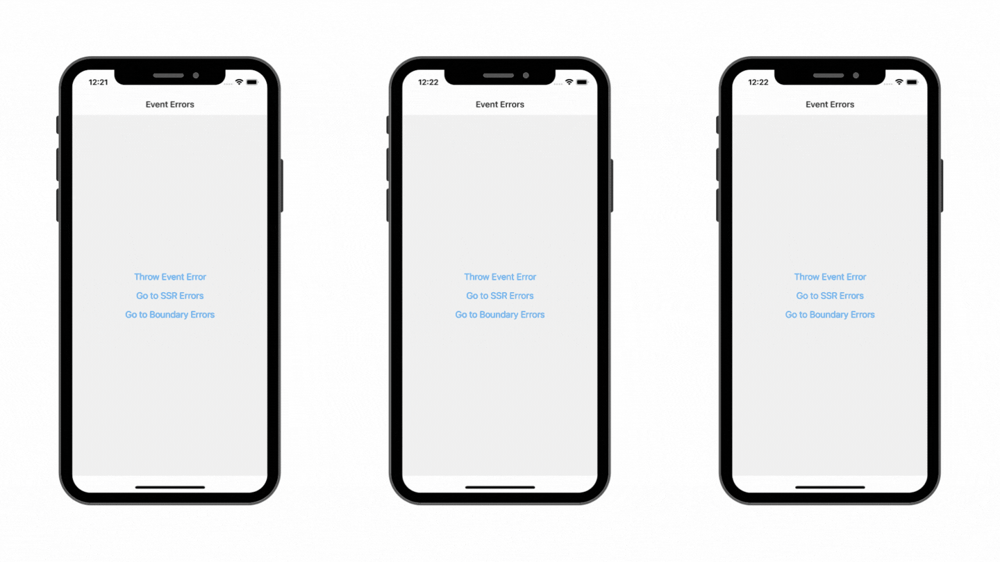

  
  

  <b>Example of handling errors in React Native app.</b> 
  Part of an article <i>"Errors handling with RN Notificated"</i>.  

---

### Description

This app is a part of an article [Errors handling with RN Notificated](https://thewidlarzgroup.com/handle-errors-with-notifications/)

---

### Installation:

- [ ] Clone the repo
- [ ] Run `yarn` from the root
- [ ] Run `cd ios && pod install && cd ..`
- [ ] Run the metro with `yarn start`
- [ ] Open the app either in a simulator with `yarn ios` / `yarn android` or on a physical device

---

### Checkpoints:

- [Checkpoint #1](https://thewidlarzgroup.com/handle-errors-with-notifications/#where-to-look-for-errors) - describe most common errors type in react native app
- [Checkpoint #2](https://thewidlarzgroup.com/handle-errors-with-notifications/#component-rendering-errors) - handle component render method errors with react-error-boundary library
- [Checkpoint #3](https://thewidlarzgroup.com/handle-errors-with-notifications/#event-handlers-and-asynchronous-callbacks-errors) - handle events errors with try catch block
- [Checkpoint #4](https://thewidlarzgroup.com/handle-errors-with-notifications/#server-side-rendering-errors) - handle SSR errors with axios interceptors
- [Checkpoint #5](https://thewidlarzgroup.com/handle-errors-with-notifications/#how-do-inform-users-about-errors) - errors handling with react-native-notificated

---
